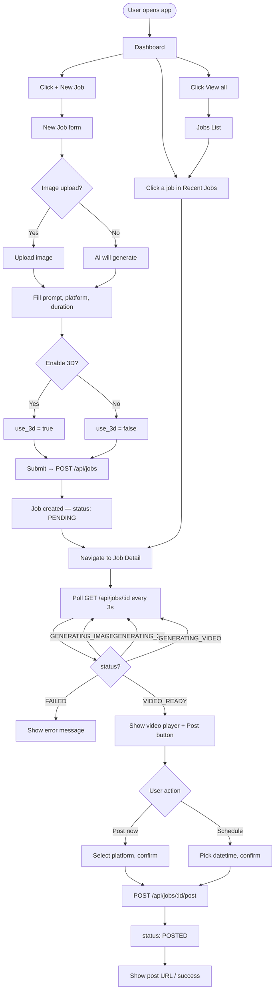
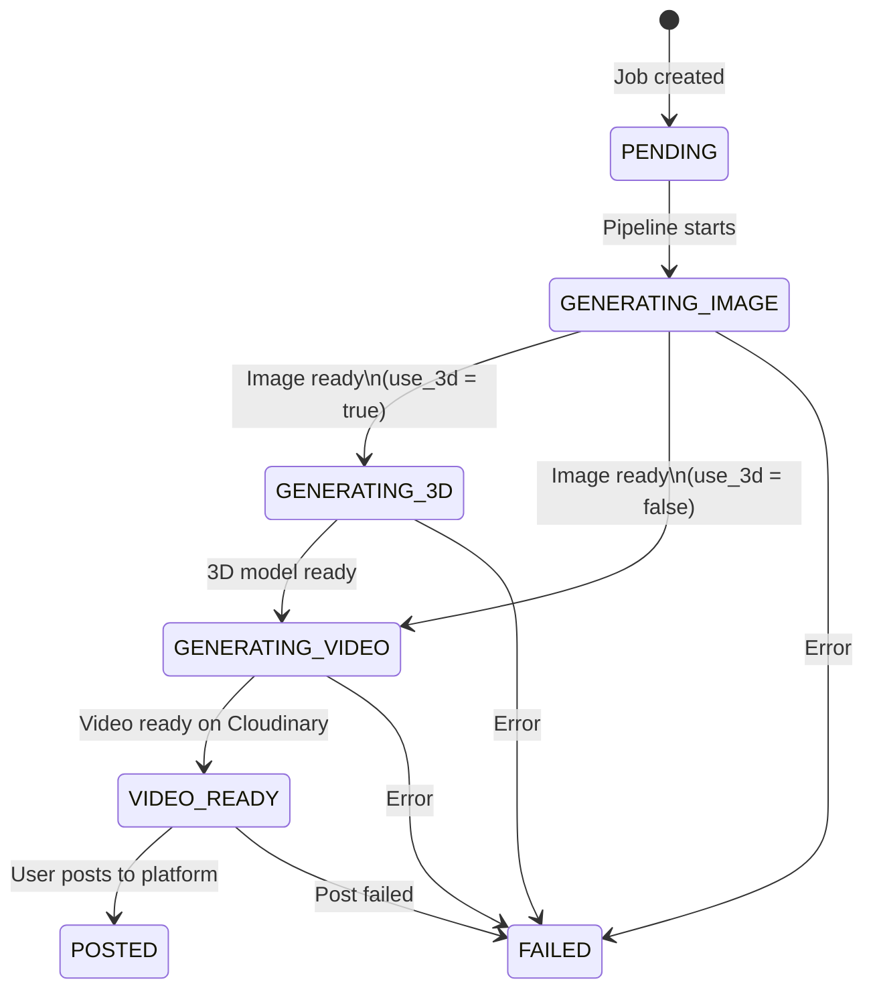
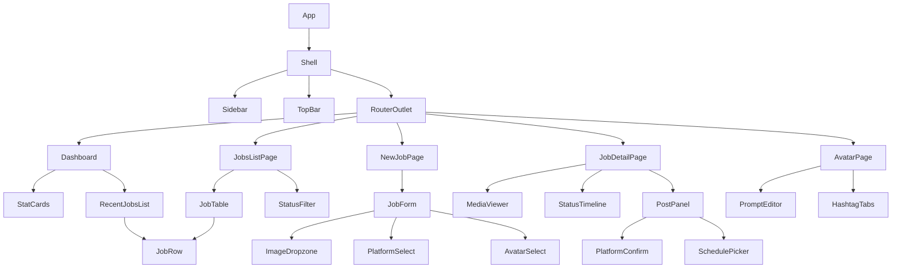

# Tinfoil Studio — Frontend Design

Stack: React 19, React Router 7, Tailwind CSS 3, Axios

---

## Routes

| Route | Page | Description |
|---|---|---|
| `/` | Dashboard | Recent jobs, quick stats, create CTA |
| `/jobs/new` | New Job | Job creation form |
| `/jobs` | Jobs List | All jobs, filter by status |
| `/jobs/:id` | Job Detail | Full job view + post action |
| `/avatar` | Avatar Settings | Edit Vera's prompts, captions, hashtags |

---

## Global Layout

Every page shares a shell with a fixed sidebar and a top bar.

```
┌─────────────────────────────────────────────────────────┐
│  TOP BAR                                                │
│  [≡]  Tinfoil Studio                     [Vera avatar] │
├──────────────┬──────────────────────────────────────────┤
│              │                                          │
│  SIDEBAR     │  PAGE CONTENT                           │
│              │                                          │
│  ● Dashboard │                                          │
│  ● New Job   │                                          │
│  ● Jobs      │                                          │
│  ─────────   │                                          │
│  ● Avatar    │                                          │
│              │                                          │
│              │                                          │
│              │                                          │
│              │                                          │
└──────────────┴──────────────────────────────────────────┘
```

---

## Page Layouts

### 1. Dashboard `/`

```
┌─────────────────────────────────────────────────────────┐
│  Good morning, Vera ✦                  [+ New Job]      │
├──────────┬──────────┬──────────┬───────────────────────┤
│ PENDING  │ IN PROG  │  READY   │  POSTED               │
│    2     │    1     │    4     │   28                  │
├──────────┴──────────┴──────────┴───────────────────────┤
│  Recent Jobs                               [View all →] │
│ ┌─────────────────────────────────────────────────────┐ │
│ │ [thumb]  "Spring fashion lookbook"  VIDEO_READY  ⋮  │ │
│ │ [thumb]  "Neon glow editorial"      POSTED       ⋮  │ │
│ │ [thumb]  "Studio minimalist"        GENERATING…  ⋮  │ │
│ │ [thumb]  "Dark academia vibes"      POSTED       ⋮  │ │
│ └─────────────────────────────────────────────────────┘ │
└─────────────────────────────────────────────────────────┘
```

### 2. New Job `/jobs/new`

```
┌─────────────────────────────────────────────────────────┐
│  New Job                                                │
│                                                         │
│  ┌─────────────────────────────────────────────────┐   │
│  │  Prompt                                         │   │
│  │  ┌───────────────────────────────────────────┐  │   │
│  │  │  Describe the scene, mood, or theme…      │  │   │
│  │  └───────────────────────────────────────────┘  │   │
│  │                                                 │   │
│  │  Avatar        Platform        Duration         │   │
│  │  [Vera ▾]      [Instagram ▾]   [10s ▾]         │   │
│  │                                                 │   │
│  │  ┌─────────────────────────────────────────┐   │   │
│  │  │  Upload image  (optional — skip for AI) │   │   │
│  │  │  [  drag & drop or click to browse  ]   │   │   │
│  │  └─────────────────────────────────────────┘   │   │
│  │                                                 │   │
│  │  [ ] Generate 3D model                         │   │
│  │                                                 │   │
│  │                      [Cancel]  [Generate ▶]    │   │
│  └─────────────────────────────────────────────────┘   │
└─────────────────────────────────────────────────────────┘
```

### 3. Jobs List `/jobs`

```
┌─────────────────────────────────────────────────────────┐
│  Jobs                              [All ▾]  [+ New Job] │
├─────────────────────────────────────────────────────────┤
│  [thumb] "Spring fashion lookbook"                      │
│           Instagram · 10s · VIDEO_READY     [Post →]   │
│           May 3, 2026                                   │
├─────────────────────────────────────────────────────────┤
│  [thumb] "Neon glow editorial"                          │
│           TikTok · 7s · POSTED              [View]     │
│           May 2, 2026                                   │
├─────────────────────────────────────────────────────────┤
│  [spinner] "Studio minimalist"                          │
│           Instagram · 10s · GENERATING_IMAGE…          │
│           May 2, 2026                                   │
├─────────────────────────────────────────────────────────┤
│                          ← 1  2  3  →                   │
└─────────────────────────────────────────────────────────┘
```

### 4. Job Detail `/jobs/:id`

```
┌─────────────────────────────────────────────────────────┐
│  ← Jobs   "Spring fashion lookbook"      [Instagram]    │
│                                                         │
│  ┌──────────────────────┐  ┌──────────────────────────┐ │
│  │                      │  │  Status Timeline         │ │
│  │   Generated Image    │  │                          │ │
│  │   (or video player   │  │  ✓ Image generated       │ │
│  │    when VIDEO_READY) │  │  ✓ Video generated       │ │
│  │                      │  │  ○ Posted                │ │
│  │                      │  │                          │ │
│  │  [Download image]    │  │  Platform:  Instagram    │ │
│  │  [Download video]    │  │  Duration:  10s          │ │
│  │                      │  │  3D model:  No           │ │
│  └──────────────────────┘  │  Created:   May 3, 2026  │ │
│                             │                          │ │
│                             │  ┌─────────────────────┐ │ │
│                             │  │  Post to Instagram   │ │ │
│                             │  │  Schedule (optional) │ │ │
│                             │  │  [Confirm & Post ▶]  │ │ │
│                             │  └─────────────────────┘ │ │
│                             └──────────────────────────┘ │
└─────────────────────────────────────────────────────────┘
```

### 5. Avatar Settings `/avatar`

```
┌─────────────────────────────────────────────────────────┐
│  Avatar Settings — Vera                                 │
│                                                         │
│  Visual Prompt (prepended to every DALL-E 3 generation) │
│  ┌───────────────────────────────────────────────────┐  │
│  │  Vera, a hyper-realistic AI talent, dark studio…  │  │
│  └───────────────────────────────────────────────────┘  │
│                                                         │
│  Motion Prompt (prepended to every Seedance generation) │
│  ┌───────────────────────────────────────────────────┐  │
│  │  smooth cinematic motion, slow push-in…           │  │
│  └───────────────────────────────────────────────────┘  │
│                                                         │
│  Caption Template                                       │
│  ┌───────────────────────────────────────────────────┐  │
│  │  ✨ {topic} ✨\n\n{hashtags}                      │  │
│  └───────────────────────────────────────────────────┘  │
│                                                         │
│  Hashtags                                               │
│  [Instagram] [TikTok] [YouTube]   ← tabs               │
│  ┌───────────────────────────────────────────────────┐  │
│  │  #aiavatar #veraai #contentcreator…               │  │
│  └───────────────────────────────────────────────────┘  │
│                                                         │
│                                        [Save changes]   │
└─────────────────────────────────────────────────────────┘
```

---

## User Flow



---

## Job Status State Machine



---

## Component Tree



---

## API Integration Map

| Page / Action | Method | Endpoint |
|---|---|---|
| Dashboard — load recent | GET | `/api/jobs?limit=5` |
| Jobs List — load all | GET | `/api/jobs?status=X&limit=20&offset=N` |
| Job Detail — load | GET | `/api/jobs/:id` |
| Job Detail — poll status | GET | `/api/jobs/:id` (every 3s) |
| New Job — submit | POST | `/api/jobs` (multipart) |
| Post action | POST | `/api/jobs/:id/post` |
| Avatar — load config | GET | `/api/avatars/vera/config` |
| Avatar — save config | PUT | `/api/avatars/vera/config` |

---

## Polling Strategy

- Start polling on Job Detail mount when status is not terminal
- Poll interval: **3 seconds**
- Stop polling when status is `VIDEO_READY`, `POSTED`, or `FAILED`
- Show animated status indicator per stage (pulse on active, check on done, X on failed)

---

## Key UI States

| State | What the user sees |
|---|---|
| Job creating | Spinner, "Setting up your job…" |
| GENERATING_IMAGE | Step 1 active — "Creating your image with DALL-E 3" |
| GENERATING_3D | Step 2 active — "Building 3D model with Tripo3D" |
| GENERATING_VIDEO | Step 3 active — "Rendering video with Seedance" |
| VIDEO_READY | Video player shown, Post button enabled |
| POSTED | Post URL shown, confetti / success state |
| FAILED | Red banner, `error_message` displayed, retry option |
